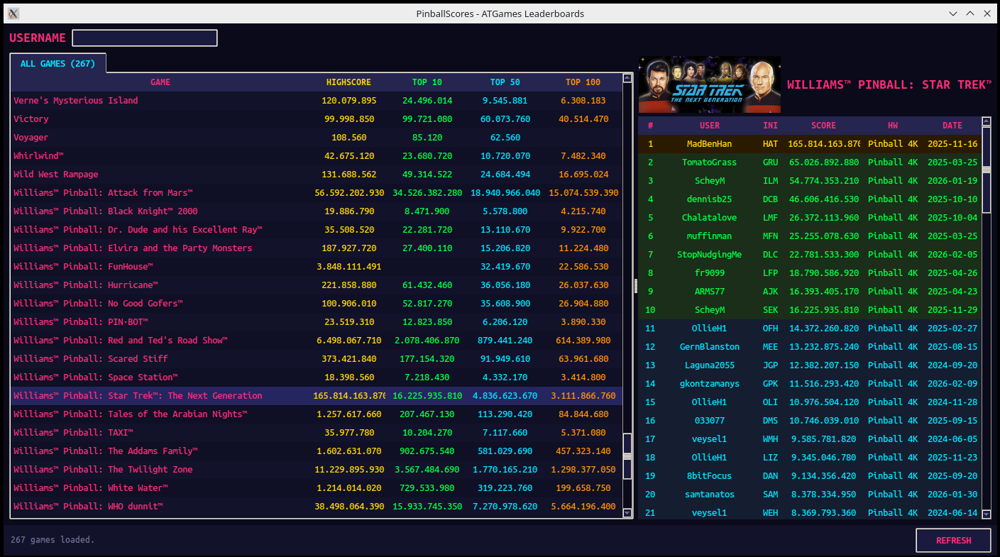
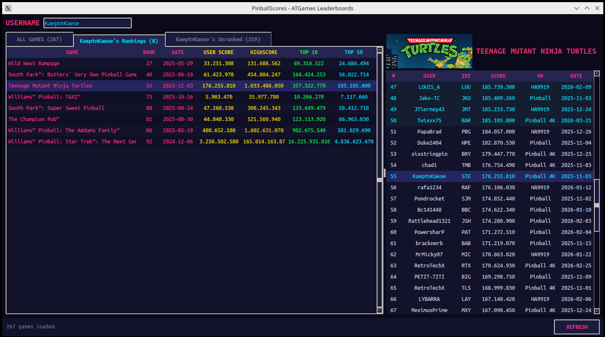

# PinballScores

A desktop app for tracking your standings on [ATGames ArcadeNet](https://www.atgames.net/leaderboards/titles) pinball leaderboards. Scrapes the top 100 scores for all games and lets you quickly see where you rank — and what you need to beat.

## Features

- **Parallel scraper** fetches all game titles and top 100 scores from ArcadeNet in under 20 seconds
- **All Games overview** with score thresholds for Highscore, Top 10, Top 50, and Top 100
- **Username lookup** shows your rank and score across all games at a glance
- **Per-user tabs**: "Rankings" (games you're ranked in) and "Unranked" (games you haven't cracked the top 100 in yet)
- **Detail view** with full top 100 list, boxart, and color-coded ranks
- **Right-click** any player in the detail view to look up their scores
- **Dark arcade theme** with per-column colored scores
- **Auto-refresh** on startup; data is cached locally for instant access
- **Username persistence** across sessions

## Screenshots





## Download

Pre-built standalone executables for Windows, Linux, and macOS are available on the [Releases](https://github.com/sstr-sbb/PinballScores/releases/latest) page. No Python installation required.

**Note:** The macOS build is untested. If you run into issues, please try the source installation below.

## Installation (from source)

Requires Python 3.10+ and a working tkinter installation (included with most Python distributions).

```bash
git clone https://github.com/sstr-sbb/PinballScores.git
cd PinballScores
python3 -m venv .venv
source .venv/bin/activate
pip install -r requirements.txt
```

## Usage

```bash
source .venv/bin/activate
python app.py
```

On first launch the app will automatically fetch all leaderboard data. Subsequent launches load cached data instantly and refresh in the background.

Enter a username in the search field to see where that player ranks across all games.

## How it works

The scraper uses the ATGames ArcadeNet API:

1. Game titles are fetched in parallel by prefix letter (A–Z)
2. Top 100 scores for each game are fetched concurrently (pipelined with step 1)
3. Data is stored as JSON in `data/scores.json`

The GUI is built with tkinter using a custom `ColorTable` widget that provides per-column foreground colors through synchronized treeviews.

## License

This project is not affiliated with ATGames. All leaderboard data is publicly available on atgames.net.
